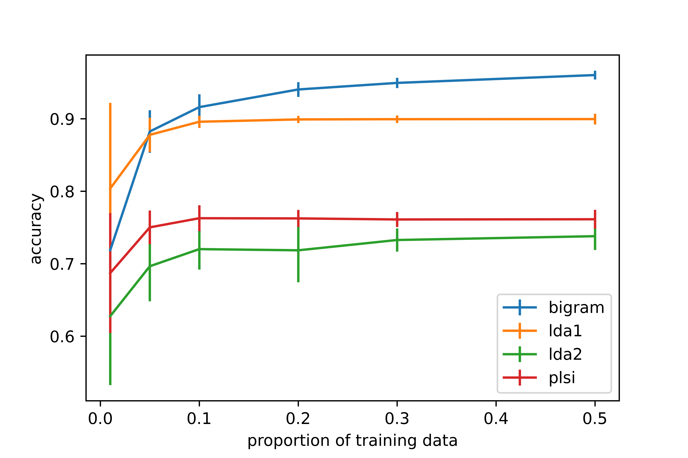

# Latent Dirichlet Allocation

Yingyu Fu, Zhuoqun Wang, Xinwen Li
April 26, 2021

## Abstract
Latent Dirichlet Allocation is a statistical model that identifies previously unknown grouping of a collection of discrete data and assigns each member of the collection a mixture of topics. In this paper, we will be focusing on the re-implementation of LDA, and the application of LDA in topic modeling. The application of topic modeling using LDA will classify each text into particular topics with a probability by predefining a fixed number of topics we want to categorize.
We report results and speeds in document modeling, comparing our naive implementations with Gensim’s lda model, probabilistic latent semantic indexing (pLSI) model, and Biterm topic model.

## Background
This project is based on the paper “Latent Dirichlet Allocation” by Blei, Ng, Jordan (2003). As stated in the paper, the goal for this algorithm is to find short descriptions of each item in a group that enables “efficient processing of large collections while extracting the essential statistical relationships that are useful for basic tasks such as classification, novelty detection, summarization, and similarity and relevance judgments”. For applying LDA onto a text corpus, the result of LDA will give us a probability distribution over a fixed number of topics for each document inside the text corpus. The result will be very useful to identify unknown topics in large unseen groups.

Some of the known applications of LDA are: Detect Functional Effects of
gene variations in biology (Backenroth et al., 2018), Discovery of overlapping communities in social networks (Airoldi et al., 2008), collaborative topic models for content recommendation at the New York Times (Wang and Blei, 2011), and Bio-LAD to find an association between chemical, genes, diseases with drug repurposing in Biological paper database to develop effective treatment more quickly(Wang et al., 2011).  

The advantages and disadvantages of LDA are clear. For the advantages, LDA does not require a uniform Dirichlet prior distribution compare to an older approach of Probabilistic latent semantic analysis (pLSA). LDA also includes 2 additional assumptions compare to pLSA. It provides a probability distribution of topics for each document. That is to say, a given document inside a corpus is more likely to contain some topics than others. The terms inside each topic also have a probability distribution, which represents certain terms that is more likely to appear inside a topic than others. Due to its complexity, LDA performs better with long text documents compare to short text documents and is less vulnerable to overfitting especially when the size of the corpus increases.

Despite the advantages, LDA is restricted to some limitations. The number of topics is fixed and must be identified ahead of time. LDA also performs poorly on short-length text documents. Comparing with Biterm topic model which performs better on short-length text corpus, the Biterm topic model models the whole corpus as a mixture of topics instead of models each document as a mixture of topics as in LDA. The Biterm topic model also inferring a topic from each bi-term instead of inferring a topic from every single word as in LDA. In the case of short text documents like tweets, each document would not have enough word samples, thus LDA will have less advantage over Biterm topic model.

We will be implementing LDA and applying it on text corpus to do topic modeling.

## Method

### Latent Dirichlet Allocation

#### Notations

- A *word* is the basic unit of the count data of interest in this paper. A word $w$ is represented with a $V$-vector, where $w^{v}=1$ if and only if $w$ is the $v$-th word in the vocabulary shared across the whole dataset.
- A *document* is a sequence of $N$ words, denoted by $\mathbb{w}=(w_1,\cdots,w_N)$, where $N$ is the total number of words in the document and is treated as an ancillary statistic.
-  A *corpus* is a set of $M$ documents denoted by $\mathcal{D}=\{\mathbb{w_1},\cdots,\mathbb{w}_M\}$.

The goal is to find a probabilistic model of a corpus.

#### Latent Dirichlet Allocation

The Latent Dirichlet Allocation (LDA) model for a single document with $N$ words can be written in the following hierarchical form:
$$
\begin{align}
w_n|z_n,\beta&\sim Multinomial(1,\beta_{z_n}),n=1,\cdots,N\\
z_n|\theta &\sim Multinomial(1,\theta),n=1,\cdots,N\\
\theta|\alpha&\sim Dir(\alpha)
\end{align}
$$
where $z_n$ is the *topic* of word $w_n$, $\beta$ is a $k\times V$ matrix with $k$ being the number of topics, and $\beta_{z_n}$ is the $z_n$-th row of $\beta$.

For a corpus with $M$ documents where document $d$ has $N_d$ words, the LDA model assumes that the documents are independently generated from the above process. Figure 1 shows a graphical model representation of LDA.

Figure 1. A graphical model representation of LDA

### Algorithm for Inference

#### The Variational EM Algorithm for LDA

In this section, we present a variational EM algorithm to find estimates of parameters $(\alpha,\beta)$ that maximizes the marginal log likelihood of the data:

$$l(\alpha,\beta)=\sum_{d=1}^M\log p(\mathbb{w_d}|\alpha,\beta)$$

The key challenge is that the marginal density $p(\mathbb{w_d}|\alpha,\beta)$ is intractable, which motivates the use of variational inference to obtain a tractable family of lower bounds on the log likelihood. As shown in ==Figure 2==, we eliminate the edges between $\theta,z,w$ and drop the $w$ nodes, and consider the family characterized by the follwing variational distributions:

$$q(\theta,z|\gamma,\phi)=q(\theta|\gamma)\prod_{n=1}^N q(z_n|\phi_n),$$

where the Dirichlet parameter $\gamma$ and the multinomial parameters $(\phi_1,\cdots,\phi_N)$ are the free variational parameters. The optimizing values $(\gamma^*,\phi^*)$ are found by minimizing the Kullback-Leibler (KL) divergence between the variational distribution and the original posterior $p(\theta,z|w,\alpha,\beta)$. Specifically, for each single document, $(\gamma^*,\phi^*)$ can be found with an iterative fixed-point method with the following update equations:
$$
\begin{align}
\phi_{ni}&\propto \beta_{iw_n}\exp\{\Psi(\gamma_i)-\Psi(\sum_j^k \gamma_j)\}\\
\gamma_i&=\alpha_i+\sum_n^N \phi_{ni}
\end{align}
$$
With this lower bound obtained from variational inference, we can find approximate empirical Bayes estimates for the LDA model via a variational EM procedure that alternates between the E-step of maximizing the lower bound with respect to the variational parameters $(\gamma,\phi)$ and the M-step of maximizing the lower bound with respect to the model parameters $(\alpha,\beta)$ for fixed values of $(\gamma,\phi)$. In the M-step, $\beta$ can be solved analytically. The derivations of the updates can be found in ==cite blei lda==.

In the M-step, there is no analytical form of the optimal $\alpha$, so it is updated with Newton-Raphson method. Due to the constraint that the elements of $\alpha$ must be positive, we let $a=\log(\alpha)$ and solve the unconstrained optimization problem with respect to $a$ instead.  

#### Algorithm Summary

After initalizing $(\alpha,\beta)$, the variational EM algorithm iterates over the following steps:

- E-step

  For each document, find the optimizing values $(\gamma^*_d,\phi^*_d)$:
  $$
  \begin{align}
  \phi_{dni}&= \frac{\beta_{iw_n}\exp\{\Psi(\gamma_{di}))\}}{\sum_i\beta_{iw_n}\exp\{\Psi(\gamma_{di}))\}}\\
  \gamma_{di}&=\alpha_{di}+\sum_n^N \phi_{dni}
  \end{align}
  $$

- M-step

  - Update $\beta$:

    $$\beta_{ij}=\frac{\sum_{d=1}^M\sum_{n=1}^{N_d}\phi^*_{dni}w_{dn}^j}{\sum_j \sum_{d=1}^M\sum_{n=1}^{N_d}\phi^*_{dni}w_{dn}^j}$$

  - Update $a$:

    Iterate the following until convergence:
    $$
    \begin{align}
    g_i&=\left(M \left(\Psi\left(\sum_{j=1}^k e^{a_j}\right)-\Psi(e^{a_i})\right) + \sum_{d=1}^M \left(\Psi(\gamma_{di})-\Psi(\sum_{j=1}^k\gamma_{dj}) \right)\right)e^{a_i}\\
    H_{il}&=\begin{cases}
    e^{a_i}M\Psi'(\sum_{j=1}^ke^{a_j})e^{a_l}, \text{if }i\neq l\\
    e^{2a_i}M(\Psi'(\sum_{j=1}^ke^{a_j})-\Psi'(e^{a_i}))+g_i, \text{if }i= l
    \end{cases}\\
    a_{new}&=a_{old}-H^{-1}g
    \end{align}
    $$

The derivations of the Newton-Raphson updates are included in the Appendix. Note that if $w_i=w_j$, then the updates associated with the two words are identical. Hence in the implementation, we only store the parameter values for the distinct words to reduce space complexity.

### Implementation

We provide two versions of implementation of LDA, one is coded from scratch (class `wrapper1` in our package) while the other is partially adapted from ==github repo here== (class `wrapper2` in our package).

==(should plain/optimized be an argument of the common method `fit_lda`???)==

The method `fit_lda` in `wrapper1` is implemented in plain python, whose performance and diagostics will be presented later. The method `fit_lda_plain` in `wrapper2` provides a plain python version of LDA without any optimization, while the `fit_lda_optimized` is optimized with ==the following techniques:==

- Parallelism
- Cython
- ...

### Comparative Analysis
We conducted comparative analysis with competing methods to evaluate the performance of LDA in feature selection for document classification as well as the speed of our two implementations of LDA.
#### Document classification
We conducted a binary classification experiment using the Reuters-21578 dataset. We focused on a randomly sampled subset of this dataset with 1000 documents for illustration purpose. We estimated the $\gamma^*$ parameter of a 20-topic LDA model on the 1000 documents without reference to the true class label, and use $\gamma^*$ as the reduced feature set. The two classes are EARN and not EARN. We trained a support vector machine (SVM) for binary classification of the documents with these reduced features. We compare the classification accuracy with an SVM trained on the conditional probabilities of topics given documents of a 5-topic probabilistic latent semantic indexing (pLSI) model and an SVM trained on the output from a bigram model.
The classification accuracy under various size of training set are shown in Figure 3. There are a two interesting observations here. First, LDA1 is always one of the best two methods, and is only dominated by bigram. Noting that bigram provides very little dimensionality reduction while LDA and pLSI reduces the number of features to 5, LDA1 is the most efficient method in feature selection. Second, LDA1 outperforms LDA2 under all choices of proportions of training data. This suggests that the chunk-wise optimization steps used in LDA1 brings a significant improvement in convergence behaviours, hence provides better estimates of the parameters. 

Figure 3. Classification results on a binary classification problem from a subset of Reuters-21578 dataset for different proportions of training data. The error bars represent one standard deviation. 

#### Speed of the algorithm
We compare the speed of our two implementations and pLSI.

- Scaling

- Comparison

Note that version 1 is way faster than version 2. This is mainly due to the fact that we avoided explicitly computing $\phi^*$ in version 1.  

### Conclusion & Discussion

The LDA model is a general-purpose probabilistic model for text corpora. The only assumption it poses on the text corpora is infinite exchangeability of words and of topics, which is reasonable under most scenarios of discrete count data. Inference under LDA can be efficiently conducted with variational EM algorithm, and the variational parameters are interpretable and can be viewed as a low-dimensional characterization of the words.

LDA can be easily applied to general high-dimensional discrete count data analysis. For example, it can be applied to 16S rRNA sequencing data and the "topics" represent the latent structures among the microbiome community. With a generative mechanism, LDA can be embedded into more sophisticated hierarchical models to account for the characteristics of certain datasets other than text corpora.  

There are two potential directions of future work on LDA. First, the prior on $\beta$ could be modified to allow a more flexible covariance structure of words within topics than that induced by a Dirichlet prior. For example, a multivariate logistic-normal prior can be adopted on each row of $\beta$. Inference under this extension can be conducted with a Hamitonian Monte Carlo step embedded in the collapsed Gibbs sampler proposed in Griffiths and Steyvers (2004), which could be computational expensive. Second, uncertainty quantifications and convergence properties of LDA could be studied.

## Appendix

### Newton-Raphson Updates

As shown in ==cite Blei==,

$$\frac{\partial \mathcal{L}}{\partial \alpha_i}=M \left(\Psi\left(\sum_{j=1}^k \alpha_j\right)-\Psi(\alpha_i)\right) + \sum_{d=1}^M \left(\Psi(\gamma_{di})-\Psi(\sum_{j=1}^k\gamma_{dj}) \right),$$

hence
$$
\begin{align}
\frac{\partial \mathcal{L}}{\partial a_i}&=\frac{\partial \mathcal{L}}{\partial \alpha_i}\frac{\partial \alpha_i}{\partial{a_i}}=\left(M \left(\Psi\left(\sum_{j=1}^k e^{a_j}\right)-\Psi(e^{a_i})\right) + \sum_{d=1}^M \left(\Psi(\gamma_{di})-\Psi(\sum_{j=1}^k\gamma_{dj}) \right)\right)e^{a_i}\\
\frac{\partial^2 \mathcal{L}}{\partial a_i\partial{a_l}}&=
\begin{cases}
e^{a_i}M\Psi'(\sum_{j=1}^ke^{a_j})e^{a_l}, \text{if }i\neq l\\
e^{2a_i}M(\Psi'(\sum_{j=1}^ke^{a_j})-\Psi'(e^{a_i}))+\frac{\partial \mathcal{L}}{\partial a_i}, \text{if }i= l
\end{cases}
\end{align}
$$

## References

#(edit format later! )
https://journals.plos.org/plosone/article?id=10.1371/journal.pone.0017243
https://www.sciencedirect.com/science/article/pii/S0002929718301150
