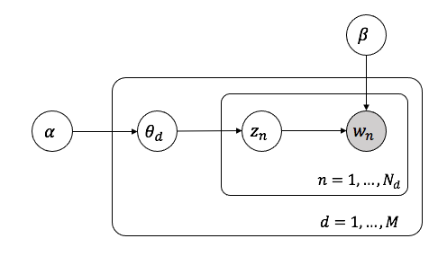

# Latent Dirichlet Allocation

## Method

### Latent Dirichlet Allocation

#### Notations

- A *word* is the basic unit of the count data of interest in this paper. A word $w$ is represented with a $V$-vector, where $w^{v}=1$ if and only if $w$ is the $v$-th word in the vocabulary shared across the whole dataset.
- A *document* is a sequence of $N$ words, denoted by $\mathbb{w}=(w_1,\cdots,w_N)$, where $N$ is the total number of words in the document and is treated as an ancillary statistic. 
-  A *corpus* is a set of $M$ documents denoted by $\mathcal{D}=\{\mathbb{w_1},\cdots,\mathbb{w}_M\}$.

The goal is to find a probabilistic model of a corpus. 

#### Latent Dirichlet Allocation

The Latent Dirichlet Allocation (LDA) model for a single document with $N$ words can be written in the following hierarchical form:
$$
\begin{align}
w_n|z_n,\beta&\sim Multinomial(1,\beta_{z_n}),n=1,\cdots,N\\
z_n|\theta &\sim Multinomial(1,\theta),n=1,\cdots,N\\
\theta|\alpha&\sim Dir(\alpha)
\end{align}
$$
where $z_n$ is the *topic* of word $w_n$, $\beta$ is a $k\times V$ matrix with $k$ being the number of topics, and $\beta_{z_n}$ is the $z_n$-th row of $\beta$. 

For a corpus with $M$ documents where document $d$ has $N_d$ words, the LDA model assumes that the documents are independently generated from the above process. Figure 1 shows a graphical model representation of LDA. 

Figure 1. A graphical model representation of LDA

### Algorithm for Inference

#### The Variational EM Algorithm for LDA

In this section, we present a variational EM algorithm to find estimates of parameters $(\alpha,\beta)$ that maximizes the marginal log likelihood of the data:

$$l(\alpha,\beta)=\sum_{d=1}^M\log p(\mathbb{w_d}|\alpha,\beta)$$

The key challenge is that the marginal density $p(\mathbb{w_d}|\alpha,\beta)$ is intractable, which motivates the use of variational inference to obtain a tractable family of lower bounds on the log likelihood. As shown in ==Figure 2==, we eliminate the edges between $\theta,z,w$ and drop the $w$ nodes, and consider the family characterized by the follwing variational distributions:

$$q(\theta,z|\gamma,\phi)=q(\theta|\gamma)\prod_{n=1}^N q(z_n|\phi_n),$$

where the Dirichlet parameter $\gamma$ and the multinomial parameters $(\phi_1,\cdots,\phi_N)$ are the free variational parameters. The optimizing values $(\gamma^*,\phi^*)$ are found by minimizing the Kullback-Leibler (KL) divergence between the variational distribution and the original posterior $p(\theta,z|w,\alpha,\beta)$. Specifically, for each single document, $(\gamma^*,\phi^*)$ can be found with an iterative fixed-point method with the following update equations:
$$
\begin{align}
\phi_{ni}&\propto \beta_{iw_n}\exp\{\Psi(\gamma_i)-\Psi(\sum_j^k \gamma_j)\}\\
\gamma_i&=\alpha_i+\sum_n^N \phi_{ni}
\end{align}
$$
With this lower bound obtained from variational inference, we can find approximate empirical Bayes estimates for the LDA model via a variational EM procedure that alternates between the E-step of maximizing the lower bound with respect to the variational parameters $(\gamma,\phi)$ and the M-step of maximizing the lower bound with respect to the model parameters $(\alpha,\beta)$ for fixed values of $(\gamma,\phi)$. In the M-step, $\beta$ can be solved analytically. The derivations of the updates can be found in ==cite blei lda==.

In the M-step, there is no analytical form of the optimal $\alpha$, so it is updated with Newton-Raphson method. Due to the constraint that the elements of $\alpha$ must be positive, we let $a=\log(\alpha)$ and solve the unconstrained optimization problem with respect to $a$ instead.  

#### Algorithm Summary

After initalizing $(\alpha,\beta)$, the variational EM algorithm iterates over the following steps:

- E-step

  For each document, find the optimizing values $(\gamma^*_d,\phi^*_d)$:
  $$
  \begin{align}
  \phi_{dni}&= \frac{\beta_{iw_n}\exp\{\Psi(\gamma_{di}))\}}{\sum_i\beta_{iw_n}\exp\{\Psi(\gamma_{di}))\}}\\
  \gamma_{di}&=\alpha_{di}+\sum_n^N \phi_{dni}
  \end{align}
  $$

- M-step

  - Update $\beta$:

    $$\beta_{ij}=\frac{\sum_{d=1}^M\sum_{n=1}^{N_d}\phi^*_{dni}w_{dn}^j}{\sum_j \sum_{d=1}^M\sum_{n=1}^{N_d}\phi^*_{dni}w_{dn}^j}$$

  - Update $a$:

    Iterate the following until convergence:
    $$
    \begin{align}
    g_i&=\left(M \left(\Psi\left(\sum_{j=1}^k e^{a_j}\right)-\Psi(e^{a_i})\right) + \sum_{d=1}^M \left(\Psi(\gamma_{di})-\Psi(\sum_{j=1}^k\gamma_{dj}) \right)\right)e^{a_i}\\
    H_{il}&=\begin{cases}
    e^{a_i}M\Psi'(\sum_{j=1}^ke^{a_j})e^{a_l}, \text{if }i\neq l\\
    e^{2a_i}M(\Psi'(\sum_{j=1}^ke^{a_j})-\Psi'(e^{a_i}))+g_i, \text{if }i= l
    \end{cases}\\
    a_{new}&=a_{old}-H^{-1}g
    \end{align}
    $$

The derivations of the Newton-Raphson updates are included in the Appendix. Note that if $w_i=w_j$, then the updates associated with the two words are identical. Hence in the implementation, we only store the parameter values for the distinct words to reduce space complexity. 

### Implementation

We provide two versions of implementation of LDA, one is coded from scratch (class `wrapper1` in our package) while the other is partially adapted from ==github repo here== (class `wrapper2` in our package). 

==(should plain/optimized be an argument of the common method `fit_lda`???)==

The method `fit_lda` in `wrapper1` is implemented in plain python, whose performance and diagostics will be presented later. The method `fit_lda_plain` in `wrapper2` provides a plain python version of LDA without any optimization, while the `fit_lda_optimized` is optimized with ==the following techniques:==

- Parallelism
- Cython
- ...

### Discussion

- Use MVN for flexible covariance structure of topics/words
- application to classification
- potential identifiability issues

## Appendix

### Newton-Raphson Updates

As shown in ==cite Blei==, 

$$\frac{\partial \mathcal{L}}{\partial \alpha_i}=M \left(\Psi\left(\sum_{j=1}^k \alpha_j\right)-\Psi(\alpha_i)\right) + \sum_{d=1}^M \left(\Psi(\gamma_{di})-\Psi(\sum_{j=1}^k\gamma_{dj}) \right),$$

hence 
$$
\begin{align}
\frac{\partial \mathcal{L}}{\partial a_i}&=\frac{\partial \mathcal{L}}{\partial \alpha_i}\frac{\partial \alpha_i}{\partial{a_i}}=\left(M \left(\Psi\left(\sum_{j=1}^k e^{a_j}\right)-\Psi(e^{a_i})\right) + \sum_{d=1}^M \left(\Psi(\gamma_{di})-\Psi(\sum_{j=1}^k\gamma_{dj}) \right)\right)e^{a_i}\\
\frac{\partial^2 \mathcal{L}}{\partial a_i\partial{a_l}}&=
\begin{cases}
e^{a_i}M\Psi'(\sum_{j=1}^ke^{a_j})e^{a_l}, \text{if }i\neq l\\
e^{2a_i}M(\Psi'(\sum_{j=1}^ke^{a_j})-\Psi'(e^{a_i}))+\frac{\partial \mathcal{L}}{\partial a_i}, \text{if }i= l
\end{cases}
\end{align}
$$
